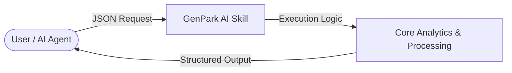

   

# genpark-ab-test-calculator-skill

> **GenPark AI Agent Skill** -- Two-tailed Z-score A/B test statistical calculator.

## Quick Start

```python
from client import ABTestCalculatorClient
client = ABTestCalculatorClient()
res = client.calculate_results(5000, 100, 5000, 140)
print(res["is_significant"])
```

## 📊 Agentic Architecture Flowchart


## 🔌 MCP (Model Context Protocol) Integration
Run natively as an MCP server for Cursor, Claude Desktop & LLM frameworks:
```bash
python mcp_server.py
```
